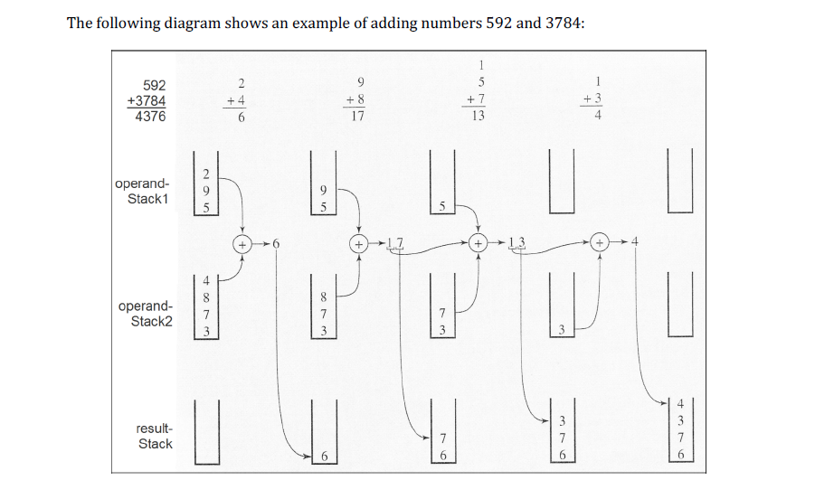
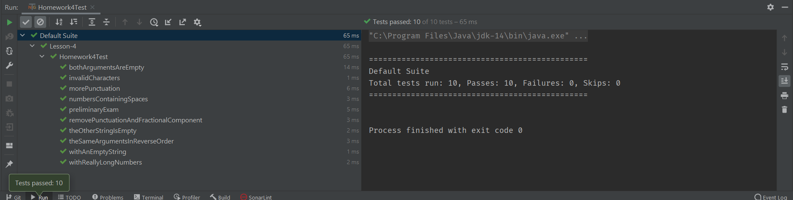
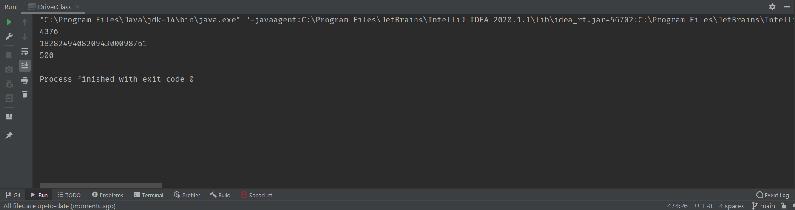

# Data Structures and Algorithms in Java (CSE-41321)
## UCSD Extension – Summer 2021 (157162)
### Homework Assignment #4
#### Introduction
The purpose of this exercises is to implement an algorithm that uses stacks to add whole numbers of any size.

The largest number that Java can store is around 9.23 quintillion (9,223,372,036,854,775,807 to be exact). Integers of
this magnitude are supported by Java's primitive data type called "long." Manipulating anything larger will 
require some sleight of hand.

In this exercise I endeavor to solve this dilemma by using the approach described in the instructor's problem statement.
Specifically, in his algorithm, numbers are processed as strings (i.e., a sequence of characters) rather than in their
binary "twos complement" format. Java supports integers only up to 9.23 quintillion. If an integer of type long is 
stored in eight bytes, you might be wondering what happened to the 64th bit. Why isn't the largest integer twice the
size? Well, a discussion about the idiosyncrasies of twos complement representation of integers is beyond the scope of
this document. Regardless, 9.23 quintillion is a very big number. But it *does* represent the limit in Java for positive
integers. How would one surmount this obstacle?

I think that the algorithm proposed by the instructor is "too cool for school!" Perhaps it's commonplace in the annals
of computer science, but it's the first time *I've* seen it.
### Background
The objective is to circumvent the constraints imposed by the Java compiler; or any other language for that matter. When
representing a number as a sequence of characters, the possibilities are practically limitless. We're talking about
numbers that could contain over two billion digits! We still have to do the math, but we never have to operate on
anything larger than single-digit operands! How does it all work? Without further ado, here is the diagram that was
provided:



After studying the diagram a bit, I moved on to the pseudocode.

Here is the pseudocode that was provided:
```text
addLargeNumbers(number1, number2)
    read the numerals of the first number and store them on one stack
    read the numerals of the second number and store them on another stack
    var result := 0
    while at least one stack is not empty
        pop a numeral from each nonempty stack and add them to result
        push the unit part of addition onto a new stack called the result stack
        store the carry part of the addition in result
        push result onto the result stack if it is not zero
    pop numbers from the result stack and display them
```
The combination of the diagram and this pseudocode helped illustrate the concept. Once I understood the concept, I was
good to go.
### Solution
While implementing my solution, I used a Stack class from the example code provided by the instructor. For the
**SinglyLinkedList** class used by the **Stack** class, I borrowed more code from the examples provided by the
instructor.

I took this opportunity to learn more about iterators. Toward that end, I modified the **Stack** class to implement the
**Iterable** interface, and added the requisite *iterator* method. Finally, I created an **Iterator** class. Thereafter,
I was able to use objects of my **Stack** class with enhanced for-loops. 😃

This project contains a a test class (**Homework4Test**) and a driver class (**DriverClass**). The test class contains
a suite of ten unit tests, which exercise the *addLargeNumbers()* method using a variety of arguments. The Driver class
contains a *main()* method, which calls  *addLargeNumbers()* several times. **Do not try to run Homework4!!** It is
*not* executable! Use *DriverClass* (or *Homework4Test*) instead.

Incidentally, while developing a version of the program that used a **Stack** that implements the **Iterable** 
interface, I was able to use *Git* to create a divergent branch of the project. Once I had the **Iterable** 
implementation working, I merged the branches to make it whole again. 😃

#### Source Code
##### Homework4
```java
package cse41321.containers;

import java.util.Iterator;
import java.util.NoSuchElementException;

class Homework4 {

    static class SinglyLinkedList<E> {
        // An element in a linked list
        public class Element {
            private E data;
            private Element next;

            // Only allow SinglyLinkedList to construct Elements
            private Element(E data) {
                this.data = data;
                this.next = null;
            }

            public E getData() {
                return data;
            }

            public Element getNext() {
                return next;
            }

            private SinglyLinkedList<E> getOwner() {
                return SinglyLinkedList.this;
            }
        }

        private Element head;
        private Element tail;
        private int size;

        public Element getHead() {
            return head;
        }

        public Element getTail() {
            return tail;
        }

        public int getSize() {
            return size;
        }

        public boolean isEmpty() {
            return size == 0;
        }

        public Element insertHead(E data) {
            Element newElement = new Element(data);

            if (isEmpty()) {
                // Insert into empty list
                head = newElement;
                tail = newElement;
            } else {
                // Insert into non-empty list
                newElement.next = head;
                head = newElement;
            }

            ++size;

            return newElement;
        }

        public Element insertTail(E data) {
            Element newElement = new Element(data);

            if (isEmpty()) {
                // Insert into empty list
                head = newElement;
                tail = newElement;
            } else {
                // Insert into non-empty list
                tail.next = newElement;
                tail = newElement;
            }

            ++size;

            return newElement;
        }

        public Element insertAfter(Element element, E data)
                throws IllegalArgumentException {
            // Check pre-conditions
            if (element == null) {
                throw new IllegalArgumentException(
                        "Argument 'element' must not be null");
            }
            if (element.getOwner() != this) {
                throw new IllegalArgumentException(
                        "Argument 'element' does not belong to this list");
            }

            // Insert new element
            Element newElement = new Element(data);
            if (tail == element) {
                // Insert new tail
                element.next = newElement;
                tail = newElement;
            } else {
                // Insert into middle of list
                newElement.next = element.next;
                element.next = newElement;
            }

            ++size;

            return newElement;
        }

        public E removeHead() throws NoSuchElementException {
            // Check pre-conditions
            if (isEmpty()) {
                throw new NoSuchElementException("Cannot remove from empty list");
            }

            // Remove the head
            Element oldHead = head;
            if (size == 1) {
                // Handle removal of the last element
                head = null;
                tail = null;
            } else {
                head = head.next;
            }

            --size;

            return oldHead.data;
        }

        // Note that there is no removeTail.  This cannot be implemented
        // efficiently because it would require O(n) to scan from head until
        // reaching the item _before_ tail.

        public E removeAfter(Element element)
                throws IllegalArgumentException, NoSuchElementException {
            // Check pre-conditions
            if (element == null) {
                throw new IllegalArgumentException(
                        "Argument 'element' must not be null");
            }
            if (element.getOwner() != this) {
                throw new IllegalArgumentException(
                        "Argument 'element' does not belong to this list");
            }
            if (element == tail) {
                throw new IllegalArgumentException(
                        "Argument 'element' must have a non-null next element");
            }

            // Remove element
            Element elementToRemove = element.next;
            if (elementToRemove == tail) {
                // Remove the tail
                element.next = null;
                tail = element;
            } else {
                // Remove from middle of list
                element.next = elementToRemove.next;
            }

            --size;

            return elementToRemove.data;
        }

        @Override
        public boolean equals(Object o) {
            if (this == o) return true;
            if (o == null || getClass() != o.getClass()) return false;

            SinglyLinkedList<?> that = (SinglyLinkedList<?>) o;

            if (this.size != that.size) return false;

            // Return whether all elements are the same
            SinglyLinkedList<?>.Element thisElem = this.getHead();
            SinglyLinkedList<?>.Element thatElem = that.getHead();
            while (thisElem != null && thatElem != null) {
                if (!thisElem.getData().equals(thatElem.getData())) {
                    return false;
                }
                thisElem = thisElem.getNext();
                thatElem = thatElem.getNext();
            }

            return true;
        }
    }

    static class Stack<E> implements Iterable<E> {
        private SinglyLinkedList<E> list = new SinglyLinkedList<E>();

        public void push(E data) {
            list.insertHead(data);
        }

        public E pop() throws NoSuchElementException {
            if (isEmpty()) {
                throw new NoSuchElementException();
            }

            return list.removeHead();
        }

        public E peek() throws NoSuchElementException {
            if (isEmpty()) {
                throw new NoSuchElementException();
            }

            return list.getHead().getData();
        }

        public int getSize() {
            return list.getSize();
        }

        public boolean isEmpty() {
            return list.isEmpty();
        }

        private class Stackerator implements Iterator<E> {
            private SinglyLinkedList<E>.Element elem;

            public Stackerator() {
                elem = Stack.this.list.getHead();
            }

            public boolean hasNext() {
                return elem != null;
            }

            public E next() {
                if (hasNext()) {
                    E data = elem.getData();
                    elem = elem.getNext();
                    return data;
                } else {
                    throw new NoSuchElementException();
                }
            }
        }

        public Iterator<E> iterator() {
            return new Stackerator();
        }

    }

    /**
     * This  method accepts  two  string  arguments. Each  argument  is expected to
     * contain  numeric characters.  Invalid  characters will  be  removed prior to
     * processing.  The arguments  will be  added together  and the  result will be
     * displayed on the console.
     *
     * This  method can  accommodate numbers  much  larger than  those supported  by
     * Java's  <i>long</i>  integer type  (approx. 9.23 quintillion). Theoretically,
     * this  method can  accommodate integers  that are  two billion  digits long  –
     * although nothing approaching that magnitude has been tested.
     *
     * Arguments containing empty strings are tolerated and are generally ignored.
     * An argument consisting of an empty string is equivalent to the value zero.
     * When both arguments are empty, no output is generated.
     *
     * @param number1 a String representing an integer value
     * @param number2 a String representing an integer value
     */
    static void addLargeNumbers(String number1, String number2) {
        Stack<Character> firstOperand = new Stack<>();
        Stack<Character> secondOperand = new Stack<>();
        Stack<Character> theSum = new Stack<>();
        // Remove any commas or fractional components from the first argument.
        String noPunctuation = number1.replaceAll("[.].*$|[^0-9]", "");
        // Push the remaining characters in the first argument onto a stack.
        for (int index = 0; index < noPunctuation.length(); index++) {
            firstOperand.push(noPunctuation.charAt(index));
        }
        // Remove any commas or fractional components from the second argument.
        noPunctuation = number2.replaceAll("[.].*$|[^0-9]", "");
        // Push the remaining characters in the second argument onto a stack.
        for (int index = 0; index < noPunctuation.length(); index++) {
            secondOperand.push(noPunctuation.charAt(index));
        }
        int intermediateResult;
        int carry = 0;
        // Repeat the following steps until both stacks are empty.
        while (!firstOperand.isEmpty() || !secondOperand.isEmpty()) {
            // intermediateResult = 0;  Hmm.., is this statement really necessary?
            intermediateResult = carry; // I changed the operator from '+=' to '='
            if (!firstOperand.isEmpty()) {
                intermediateResult += Integer.parseInt(firstOperand.pop().toString());
            }
            if (!secondOperand.isEmpty()) {
                intermediateResult += Integer.parseInt(secondOperand.pop().toString());
            }
            // Convert the integer (int) result to char and push it onto the stack.
            theSum.push(Integer.toString(intermediateResult % 10).charAt(0));  // Yikes!
            carry = intermediateResult / 10;    // Save the carry amount.
        }
        for (Character digit : theSum) System.out.print(digit);
        System.out.println();
    }

}

class DriverClass {

    public static void main(String[] args) {
        String aLargeNumber = "8,129,498,165,026,350,236.5678";
        String aLargerNumber = "18,274,364,583,929,273,748,525.1234";
        Homework4.addLargeNumbers("592.25", "3,784.50");
        Homework4.addLargeNumbers(aLargeNumber, aLargerNumber);
        Homework4.addLargeNumbers("100.101", "400.201");
    }

}
```
##### Homework4Test
```java
package cse41321.containers;

import org.testng.annotations.AfterMethod;
import org.testng.annotations.BeforeMethod;
import org.testng.annotations.Test;

import java.io.ByteArrayOutputStream;
import java.io.PrintStream;

import static org.testng.Assert.*;

public class Homework4Test {
    private final PrintStream originalStdOut = System.out;
    private ByteArrayOutputStream consoleContent = new ByteArrayOutputStream();
    private final String theAnswer = "18282494082094300098761";

    @BeforeMethod
    public void setUp() {
        // Redirect all System.out to consoleContent.
        System.setOut(new PrintStream(this.consoleContent));
    }

    @AfterMethod
    public void tearDown() {
        System.setOut(this.originalStdOut);     // Restore original standard out
        // Clear the consoleContent.
        this.consoleContent = new ByteArrayOutputStream();
    }

    @Test
    public void withReallyLongNumbers() {
        // By the way, I couldn't find anything on the Internet that could add these two numbers!
        Homework4.addLargeNumbers("18274364583929273748525", "8129498165026350236");
        assertTrue(this.consoleContent.toString().contains(theAnswer));
    }

    @Test
    public void numbersContainingSpaces() {
        Homework4.addLargeNumbers("18 274 364 583 929 273 748 525", "8 129 498 165 026 350 236");
        assertTrue(this.consoleContent.toString().contains(theAnswer));
    }

    @Test
    public void withAnEmptyString() {
        Homework4.addLargeNumbers("18274364583929273748525", "");
        assertTrue(this.consoleContent.toString().contains("18274364583929273748525"));
    }

    @Test
    public void theOtherStringIsEmpty() {
        Homework4.addLargeNumbers("", "8129498165026350236");
        assertTrue(this.consoleContent.toString().contains("8129498165026350236"));
    }
    
    @Test
    public void bothArgumentsAreEmpty() {
        Homework4.addLargeNumbers("", "");
        assertTrue(this.consoleContent.toString().contains(""));
    }

    @Test
    public void theSameArgumentsInReverseOrder() {
        Homework4.addLargeNumbers("8129498165026350236", "18274364583929273748525");
        assertTrue(this.consoleContent.toString().contains(theAnswer));
    }

    @Test
    public void removePunctuationAndFractionalComponent() {
        Homework4.addLargeNumbers("18,274,364,583,929,273,748,525.1234", "8,129,498,165,026,350,236.5678");
        assertTrue(this.consoleContent.toString().contains(theAnswer));
    }

    @Test
    public void invalidCharacters() {
        Homework4.addLargeNumbers("ABC.DEF", "GHI.JKL");
        assertTrue(this.consoleContent.toString().contains(""));
    }

    @Test
    public void morePunctuation() {
        Homework4.addLargeNumbers("18_274_364_583_929_273_748_525.1234", "8_129_498_165_026_350_236.5678");
        assertTrue(this.consoleContent.toString().contains(theAnswer));
    }

    @Test
    public void preliminaryExam() {
        Homework4.addLargeNumbers("592.25", "3,784.50");
        assertTrue(this.consoleContent.toString().contains("4376"));
    }
}
```
## Output
### Test Suite

### Homework4::addLargeNumbers()

## Summary
Getting an early start on this assignment was both a blessing and a curse. Starting early gave me plenty of time to
address those hidden bugs that inevitably pop up. On the other hand, having that much time allowed me to indulge my
obsessive nature. I'm constantly finding little things that I can improve, not the least of which is this README file.

I was able to understand the concept very quickly, but the road to a successful implementation was bumpier than I
expected. On at least two occasions I had to reengineer what initially appeared to be a viable solutions. Consequently,
although I thought I'd finished this project on at least a couple of occasions, once again I'm up against the clock.
Okay. I'm exaggerating a bit. I have only this README file left to finish. Earlier this morning I eliminated the last
bug. It really wasn't a bug, but a section of code that I thought could benefit from a facelift. Some of the constructs
in my original solution weren't very sophisticated, and not representative of my best work.

Recently I got the impression that some of my fellow students are able to finish these assignments in a couple of days!!
Wow! Are these assignments really that easy?! What's wrong with *me*? Of course I don't have concrete evidence
on which to base my suspicions; the evidence is purely circumstantial. Besides, I remember the days when I could do the
same. In fact, in a previous class I turned in five assignments in one week.  The assignments were easier back then, and
even though it was an introductory class, much of the material was review. But I digress…

I'm discovering that I'm not as adept as I once was at interpreting pseudocode. Much to my amusement, my final
implementation of the algorithm looked a lot more like the pseudocode than it did when I started! I remember the days
when we used flowcharts. I *miss* flowcharts. Where's my copy of Visio? I was an early adopter of that application. I
thought it was the bees knees! I have nothing against pseudocode. I'm just out of practice.

One of the ways in which I'm trying to get control of my obsessive behavior is to set deadlines. It's 8:10 PM on the
night of the due date, and I'm giving myself until 9 PM to hit the submit button. At this point, there really isn't
anything I could do to make it better. During this project I've accomplished most of the things I wanted to. If there's
one thing missing from this assignment, it's the (better) use of Exceptions. I wanted to write my own Exception class,
but didn't get around to it.

Okay, I guess that's gonna have to be *it*. I'll close with the usual caveat, that this README is a work in progress,
with a format that is constantly evolving. One of these days I'll do some research to find out whether there is an
industry-standard layout.

---
Oops! I did it again! It's 10 PM! ☹️I found something in the code that I wanted to change. I couldn't resist!

Also, I discovered that the emoji's I'm embedding in my markdown document are not surviving the conversion to PDF.
